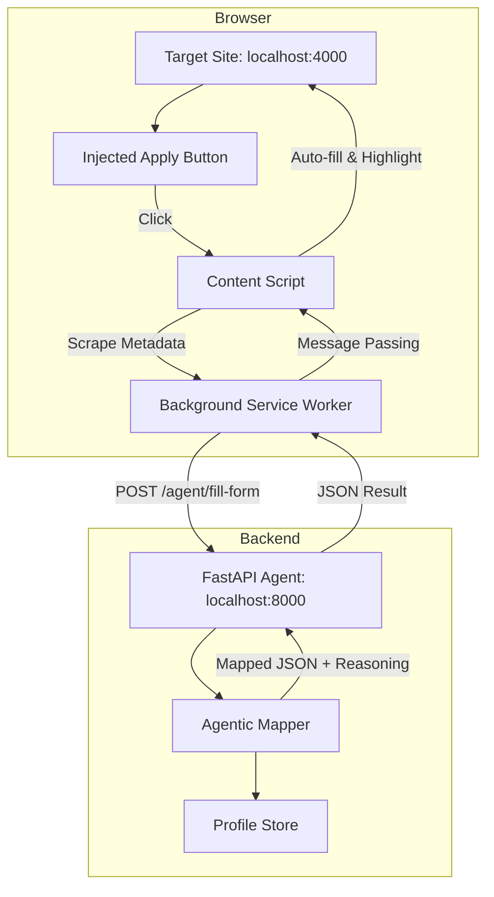

# Agentic Form Auto-fill System

A secure, local-first system designed to intelligently auto-fill web forms on `localhost:4000` using a Python-based agent and a Chrome Extension.

## 1. Architecture Diagram



## 2. Component Overviews

### Extension Code (Manifest V3)
- **`manifest.json`**: Scopes the extension to `localhost:4000` and registers the background service worker.
- **`content_script.js`**: Handles DOM manipulation, button injection (non-intrusive), and visual feedback (Green highlights/Toasts).
- **`background.js`**: Managed API communication with the backend to ensure security and CORS compliance.

### Python FastAPI Agent
- **`main.py`**: A robust FastAPI server providing two main roles:
    - **Data Store**: Secure, local-only profile data.
    - **Agentic Engine**: A pluggable mapping system.

### Field-Matching Logic (Agentic)
The system uses a **Deterministic Scoring Engine**:
- **Semantic Matching**: Uses synonyms (e.g., "Mobile" → "Phone") and context signatures.
- **Confidence Scoring**: 
    - `1.0`: Exact attribute match.
    - `0.8`: Long keyword semantic match.
    - `0.6`: Short keyword match.
- **Thresholding**: The agent skips any field with a confidence `< 0.5`.
- **Reasoning**: Every decision is logged with a human-readable explanation (e.g., *"Matched 'contact_num' with 'phone' due to synonym rule"*).

## 3. Security & Privacy
- **Strictly Local**: No data ever leaves the machine. No third-party APIs (OpenAI/Google), no analytics, and no tracking.
- **Isolation**: The Extension is only active on the specified target domain.
- **Secure Bridge**: Background scripts act as a secure proxy for API requests, preventing the Target Site from accessing the Backend Agent.

## 4. Setup & Running

### Prerequisites
- Python 3.9+
- Chrome Browser

### Step 1: Run the Backend
```bash
cd e:\gdg-gandhinagar-final\extension\backend
pip install -r requirements.txt
python main.py
```
*Verify: [http://localhost:8000/profile](http://localhost:8000/profile)*

### Step 2: Run the Mock Target Site
```bash
cd e:\gdg-gandhinagar-final\extension\target_site_mock
python -m http.server 4000
```
*Verify: [http://localhost:4000/index.html](http://localhost:4000/index.html)*

### Step 3: Load the Extension
1. Open Chrome and go to `chrome://extensions`.
2. Enable **Developer Mode**.
3. Click **Load unpacked** and select `e:\gdg-gandhinagar-final\extension\chrome_extension`.

### Step 4: Verify
1. Navigate to [http://localhost:4000](http://localhost:4000).
2. Click **✨ Apply with Agent**.
3. Open **Console (F12)** to see the Agentic Reasoning logs.
